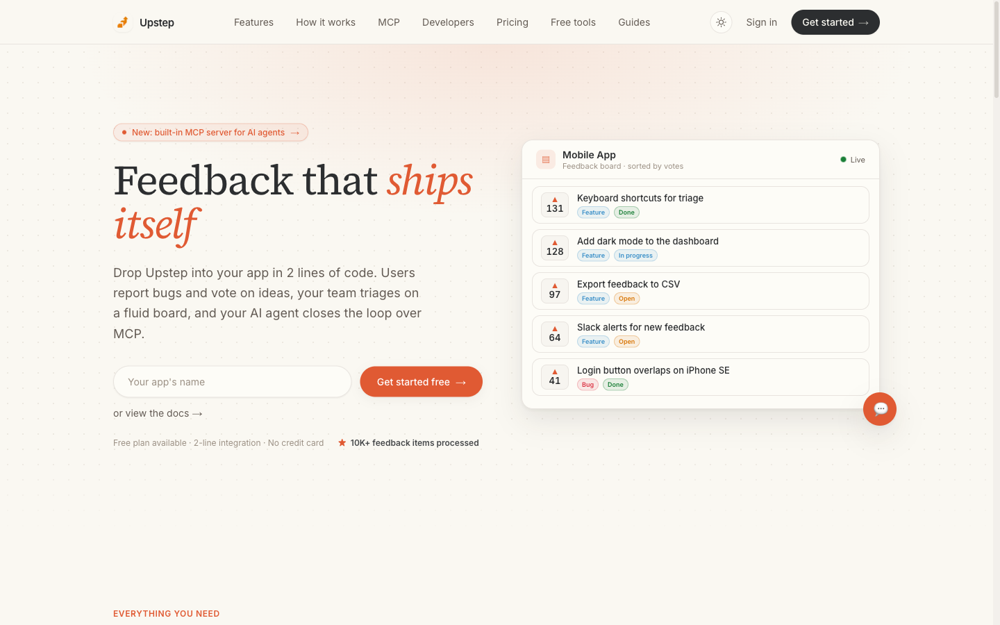
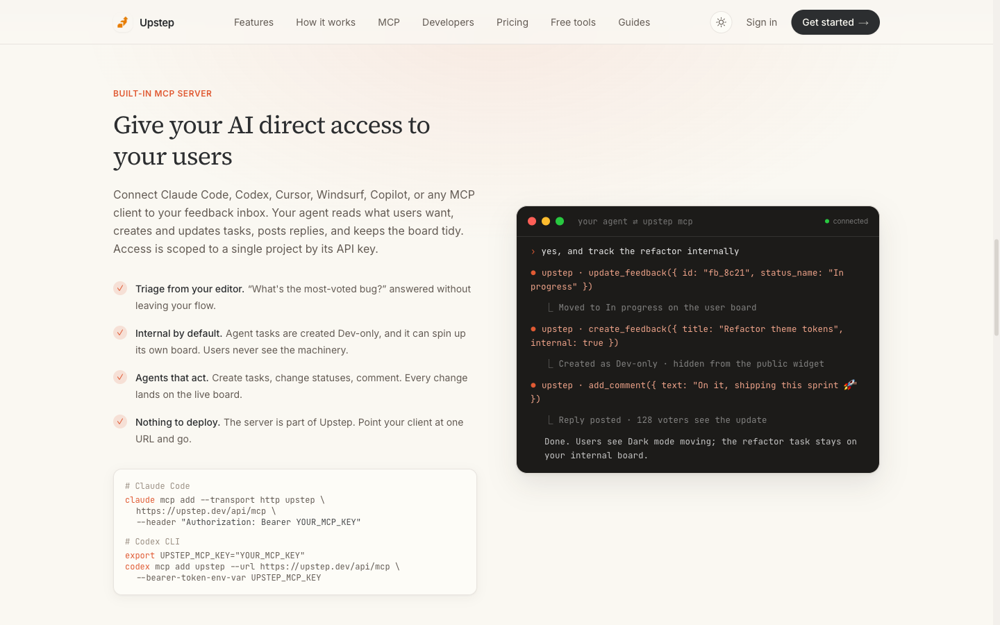
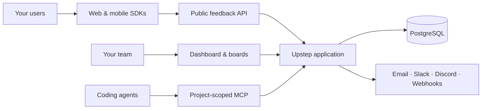

<p align="center">
  <a href="https://upstep.dev">
    
  </a>
</p>

<h1 align="center">Upstep</h1>

<p align="center">
  <strong>Feedback that ships itself.</strong><br />
  Collect feedback inside your product, let users vote, triage on a fluid board,<br />
  and give your coding agent a direct line to what users want.
</p>

<p align="center">
  <a href="https://upstep.dev"><strong>Live product</strong></a>
  &nbsp;·&nbsp;
  <a href="DOCUMENTATION.md"><strong>Documentation</strong></a>
  &nbsp;·&nbsp;
  <a href="#quick-start"><strong>Self-host</strong></a>
  &nbsp;·&nbsp;
  <a href="CONTRIBUTING.md"><strong>Contribute</strong></a>
</p>

<p align="center">
  
  
  
  
  
  
</p>

<p align="center">
  
</p>

## One feedback loop, end to end

Most feedback tools stop at collecting ideas. Upstep connects the whole loop:
the widget your users see, the board your team works from, the public roadmap
you share, and the MCP tools your agent can act through.

| | |
| --- | --- |
| **Embedded feedback** | Drop a native widget into web, React, React Native, or Flutter without sending users to another portal. |
| **Voting that prioritizes itself** | Identified and anonymous voting with deduplication turns requests into a ranked backlog. |
| **Fluid triage boards** | Use custom boards, statuses, labels, moderation, internal tasks, and completed-item views without drowning in filters. |
| **An agent that can act** | Claude Code, Codex, Cursor, Windsurf, Copilot, or any MCP client can read, create, update, and comment on project-scoped work. |
| **A roadmap users can trust** | Publish the work that matters while keeping developer and agent tasks private. |
| **Self-hosted by default** | Run the same Next.js and PostgreSQL stack yourself. Redis is not required. |

## Built for humans and agents

Upstep's MCP server is part of the application—not a separate sidecar. A
private, project-scoped key lets an agent triage feedback from the editor while
publishable SDK keys remain safe to embed in client applications.

<p align="center">
  
</p>

```bash
# Claude Code
claude mcp add --transport http upstep https://upstep.dev/api/mcp \
  --header "Authorization: Bearer YOUR_MCP_KEY"

# Codex CLI
export UPSTEP_MCP_KEY="YOUR_MCP_KEY"
codex mcp add upstep --url https://upstep.dev/api/mcp \
  --bearer-token-env-var UPSTEP_MCP_KEY
```

## Two lines from feedback

```bash
npm install @upstep/js
```

```tsx
import { FeedbackWidget, UpstepProvider } from "@upstep/js/react";

export function App() {
  return (
    <UpstepProvider apiKey="upstep_pk_your_publishable_key">
      <YourProduct />
      <FeedbackWidget />
    </UpstepProvider>
  );
}
```

The same feedback loop is available for vanilla JavaScript, script tags,
React Native, and Flutter. See the [complete SDK guide](DOCUMENTATION.md#sdks).

## How it fits together



Everything runs in one deployable application with durable PostgreSQL-backed
rate limiting and notification retries.

## Quick start

You need Docker with Compose and either a GitHub or Google OAuth application.

```bash
git clone https://github.com/TheBugEater/upstep.git
cd upstep
cp apps/web/.env.example apps/web/.env
docker compose up --build
```

Add your database, auth secret, and OAuth credentials to
`apps/web/.env`, then open [http://localhost:3000](http://localhost:3000).
For GitHub OAuth, use this local callback URL:

```text
http://localhost:3000/api/auth/callback/github
```

The Compose stack starts PostgreSQL, applies committed Prisma migrations,
starts Upstep, and processes durable notification retries. Production
containers expose `GET /api/health` and respect the platform's `PORT`.

### Local development

```bash
corepack enable
pnpm install
cp apps/web/.env.example apps/web/.env
docker compose up -d postgres
pnpm --filter @upstep/web exec prisma migrate deploy
pnpm dev
```

```bash
pnpm test
pnpm type-check
pnpm build
```

## Credentials are intentionally separate

| Credential | Where it belongs | Access |
| --- | --- | --- |
| `upstep_pk_…` | Browser and mobile SDKs | Publishable; limited to the public feedback API |
| `upstep_mcp_…` | Secret stores and MCP clients | Private; project-scoped read/write access |

Private MCP keys are returned once and stored only as SHA-256 digests. Never
use a publishable SDK key as an authorization boundary for private data. Read
the full [security policy](SECURITY.md) before exposing a production instance.

## Repository map

```text
apps/web/                    Next.js dashboard, API, MCP and marketing site
packages/sdk-web/            @upstep/js
packages/sdk-react-native/   @upstep/react-native
packages/sdk-flutter/        upstep_flutter
packages/types/              @upstep/types
```

| Resource | What you will find |
| --- | --- |
| [Documentation](DOCUMENTATION.md) | Setup, environment variables, SDKs, REST API, data model, billing, and dashboard behavior |
| [Contributing](CONTRIBUTING.md) | Development workflow, migrations, tests, and pull requests |
| [Security](SECURITY.md) | Vulnerability reporting and credential model |
| [Code of Conduct](CODE_OF_CONDUCT.md) | Community expectations |
| [Licensing](LICENSING.md) | AGPL server and MIT SDK boundaries |
| [Trademark policy](TRADEMARKS.md) | Rules for the Upstep name and logo |

## Deployment and operations

`railway.toml` configures the hosted deployment, but any platform that can run
a Node.js container and PostgreSQL can host Upstep. Apply
`prisma migrate deploy` before each release, call
`POST /api/internal/notifications` every minute with
`Authorization: Bearer $CRON_SECRET`, and test database restores regularly.

Self-hosted instances send no Upstep product analytics when
`NEXT_PUBLIC_ONRAMP_API_KEY` is blank, which is the default.

## License

The server application is licensed under
[AGPL-3.0-only](LICENSE). Independently distributed SDK and shared-type
packages are licensed under MIT. The Upstep name and logos are governed by the
[trademark policy](TRADEMARKS.md).

<p align="center">
  Built for builders who would rather ship than manage another feedback tool.
</p>
